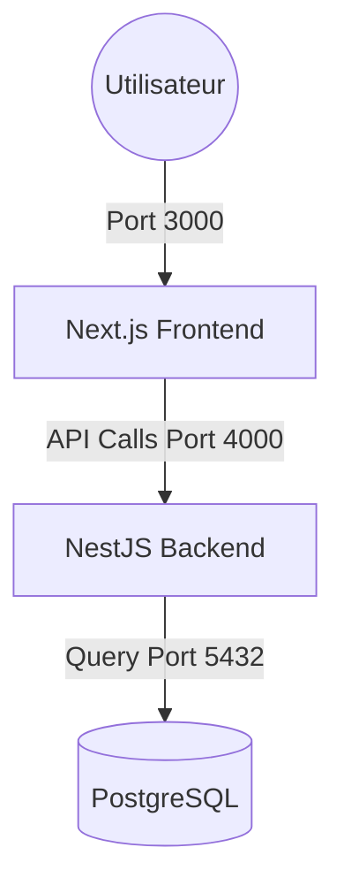

# ParaLux - AI-Driven Skincare SaaS 🌿✨

ParaLux est une plateforme e-commerce innovante qui transforme la routine de soin de la peau grâce à l'intelligence artificielle. Le système analyse le profil dermatologique de l'utilisateur pour recommander des produits parfaitement adaptés.

## 🏗️ Architecture Technique

Le projet repose sur une architecture moderne, scalable et containerisée.

### Stack Technologique
- **Frontend** : Next.js 15 (App Router), Tailwind CSS, Axios.
- **Backend** : NestJS (Node.js), TypeScript.
- **Base de Données** : PostgreSQL (avec support JSONB pour les diagnostics).
- **Infrastructure** : Docker & Docker Compose.
- **Sécurité** : Authentification JWT (JSON Web Tokens), hachage des mots de passe via bcrypt.

### Schéma de l'Infrastructure


## 🚀 Fonctionnalités Clés

### 1. Moteur de Diagnostic IA
Le cœur du système est un moteur d'analyse qui suit le flux suivant :
- **Collecte** : Quiz interactif (Type de peau, sensibilité, préoccupations, âge, environnement).
- **Analyse** : Algorithme de détermination du profil cutané.
- **Matching** : Filtrage intelligent du catalogue produits basé sur le profil détecté et les préoccupations spécifiques.
- **Conseils** : Génération de recommandations personnalisées.

### 2. Authentification & Utilisateurs
- Système complet d'inscription et de connexion.
- Protection des routes via tokens JWT.
- Gestion des rôles (Customer, Admin).

### 3. Catalogue Produits
- Gestion CRUD complète des produits.
- Indexation par type de peau pour optimiser les recommandations de l'IA.

## 🛠️ Installation & Lancement

### Pré-requis
- Docker et Docker Compose installés.

### Lancement rapide
```bash
# Cloner le dépôt
git clone <repository-url>
cd paralux

# Lancer l'infrastructure complète
docker compose up -d
```

- **Frontend** : `http://localhost:3000`
- **Backend API** : `http://localhost:4000`

## 📁 Structure du Projet
- `/backend` : Logique API, Entités TypeORM, Services IA.
- `/frontend` : Interface utilisateur Next.js, Client API.
- `/infra` : Configuration Docker et orchestration.
